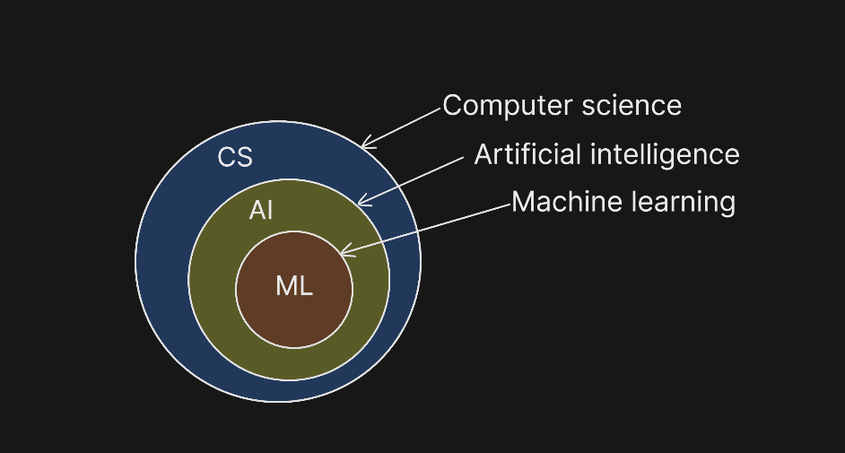

# Machine Learning Course - Day 01 Notes

## 1. Introduction to AI and Automation

It is fundamental to distinguish between **Artificial Intelligence (AI)** and **Automation**, as they are often confused but represent different concepts.

- **Automation**: Refers to a system performing a repetitive task automatically based on a strict set of pre-defined rules. It does not "think"; it just follows instructions.
- **AI (Artificial Intelligence)**: Refers to the simulation of **Human Intelligence** in machines. When a system uses capabilities similar to human cognition (learning, problem-solving, perception) to perform a task, it is considered AI.

## 2. Categories of AI

Artificial Intelligence is generally categorized into three types based on capability:

1.  **Narrow AI (Weak AI)**:
    - AI designed for a specific, limited task.
    - **Examples**: Facial recognition systems, Google Search, Self-driving cars, Voice assistants.
    - **Status**: This is the _only_ form of AI that currently exists in the real world.
2.  **General AI (Strong AI)**:
    - AI that possesses the ability to understand, learn, and apply knowledge across a wide variety of tasks, indistinguishable from a human mind.
    - **Status**: Theoretical. It does not yet exist.
3.  **Super AI**:
    - AI that surpasses human intelligence and capabilities in every aspect (creativity, general wisdom, problem-solving).
    - **Status**: A futuristic concept.

## 3. The Hierarchy: CS, AI, and ML

To understand where Machine Learning fits, we can visualize a hierarchy of fields:

- **Computer Science (CS)**: The broad field of study covering computers and computational systems.
  - **Artificial Intelligence (AI)**: A sub-field of Computer Science focused on creating intelligent agents.
    - **Machine Learning (ML)**: A sub-field of AI. It involves using statistical algorithms to enable computers to learn from data without being explicitly programmed for every rule.

## 4. Types of Software Systems

Software systems can be broadly divided into two approaches based on how they solve problems:

### A. Rule-Based Systems (Traditional Programming)

- **Mechanism**: These systems rely on explicit, hard-coded rules defined by a programmer.
- **Flow**: `Input` -> `Explicit Rules` -> `Output`.
- **Usage**: Best used when the rules of the task are clear, logical, and well-defined.
- **Example**: **Sorting Algorithms**. We know exactly how to compare two numbers and swap them. The logic is precise and unchanging.
- **Transparency (White Box)**: These systems are considered "White Box" models. We can easily see and understand exactly how the system reached a specific conclusion because the code logic is visible and follows a clear path.

### B. Learning-Based Systems (Machine Learning)

- **Mechanism**: These systems learn patterns from data rather than following explicit rules.
- **Flow**: `Input` + `Output Data` -> `Learning Algorithm` -> `Model`.
- **Usage**: Best used when the rules are complex, unclear, or impossible to write down manually.
- **Example**: **Handwritten Digit Recognition**. It is extremely difficult to write explicit rules for every possible way a person might write the number "5" (e.g., different curves, sizes, thickness). Instead, we feed the system thousands of examples, and it learns the visual patterns that distinguish a "5" from a "3".
- **The Model**: The result of this training process is a "Model". The model takes new inputs and predicts outputs based on what it learned.
- **Transparency (Black Box)**: ML models (especially Deep Learning / Neural Networks) are often "Black Box" models. We know the input and the output, but the internal decision-making process (often involving millions of mathematical parameters) is difficult for humans to interpret intuitively.

> **Note**: Traditional programming is not "dead" or replaced. It remains the best and most efficient tool for problems with clear logic. ML is a specialized tool for problems where traditional programming fails.

## 5. Mathematical Foundations

Machine Learning is built upon several key mathematical concepts:

- **Statistics & Probability**: For handling uncertainty, analyzing data distributions, and making predictions.
- **Calculus**: Used primarily for **Model Optimization**. It helps us calculate how to adjust the model to reduce errors (e.g., using derivatives to find the minimum error).
- **Linear Algebra**: The "backbone" of ML data representation.
  - **Vectors & Matrices**: Data is often represented as vectors (lists of numbers) or matrices (grids of numbers).
  - **Why Vectors?**: They allow us to perform mathematical operations on large sets of features simultaneously and efficiently.

## 6. Roles in the Industry

It is crucial to understand the different roles in the AI ecosystem:

### Software Engineer (SE)

- **Focus**: Rule-Based Systems.
- **Role**: They write the explicit logic for applications where rules are clear. They build the traditional infrastructure of applications.

### Machine Learning (ML) Engineer

- **Focus**: Building the "Brain" (The Model).
- **Role**:
  - They select the algorithms, prepare the data, and **train** the model.
  - They **optimize** the model to improve accuracy.
  - They **test** and **deploy** the model to production.
  - Their primary output is a functioning, accurate prediction model.

### AI Engineer

- **Focus**: Building the "System".
- **Role**:
  - They take the models built by ML Engineers and integrate them into complete software solutions.
  - They bridge the gap between the raw model and the end-user application, ensuring the model interacts correctly with the rest of the system.

## 7. The Engineering Decision Process

When facing a problem, how do we decide which approach to use?

1.  **Analyze the Problem**: Ask yourself, "Are the rules for solving this problem clear and definable?"
2.  **If YES (Rules are Clear)**:
    - **Approach**: Use **Traditional Programming** (Rule-Based).
    - **Role**: Software Engineer.
    - **Why**: It is faster, more efficient, and fully explainable.
3.  **If NO (Rules are Unclear/Complex)**:
    - **Approach**: Use **Machine Learning** (Learning-Based).
    - **Role**: ML Engineer.
    - **Process**: Collect Data -> Train Model -> Optimize -> Deploy.
    - **Why**: The system can learn the complex patterns that humans cannot explicitly program.

---

### Summary of Key Tools

- **Traditional**: Standard coding languages (Java, Python, C++).
- **ML/AI**:
  - **Assistants**: GitHub Copilot, Gemini CodeAssist, Cursor.
  - **Concepts**: Neural Networks, Deep Learning.
